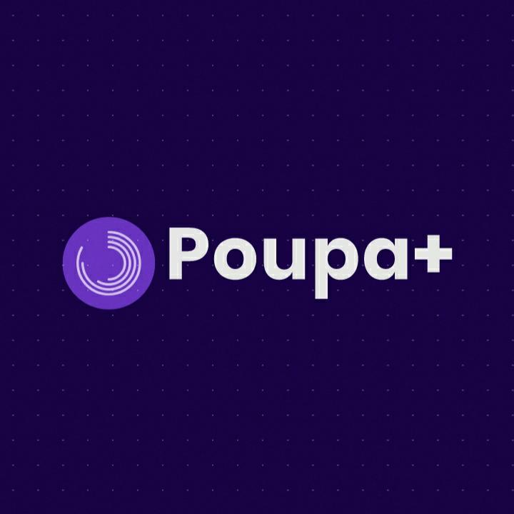
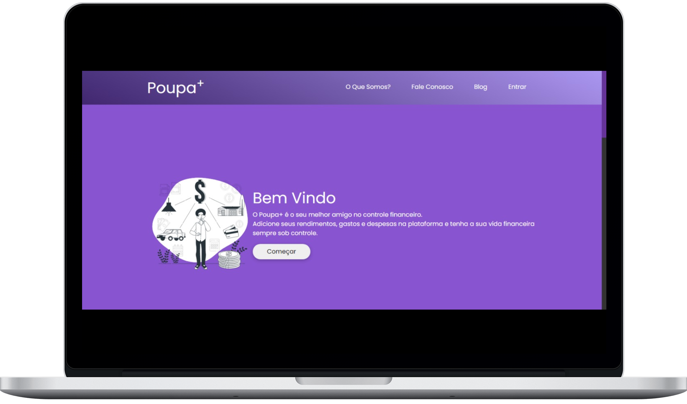
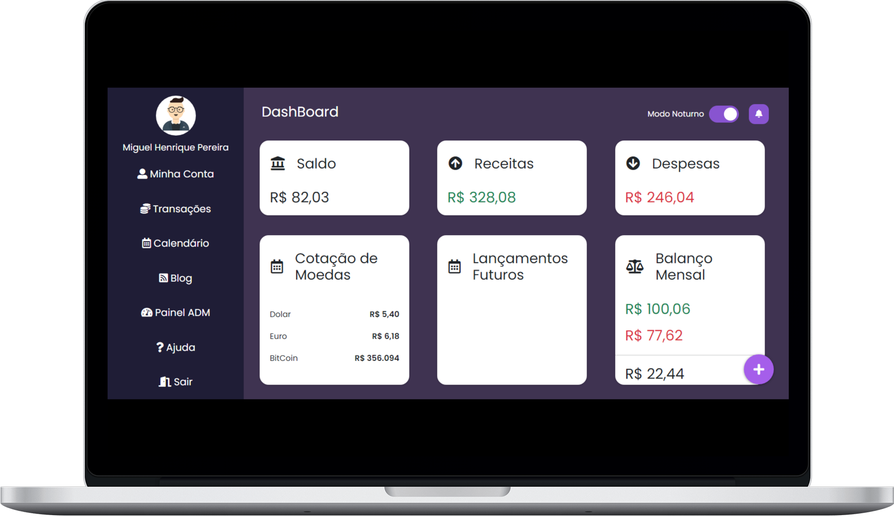

<div style='text-align:center'>
  
 </div>

# Poupa+

**This platform was developed to facilitate the management of your personal finances, simplifying your daily life and providing easy-to-understand information about where your money is going and where you can save.**

---

## 🚀 Technologies

- PHP7
- JavaScript
- MySql
- Html5
- Css3
- Jquery
- Bootstrap5
- FontAwesome
- GoogleFonts API
- Chart.Js
- FullCalendar.io
- Material Design Lite

---

## 🛠️ Installation

- Inside the Controller folder, create a folder named `config` and inside it, create a file named `ENV.php` with the following structure:

```php
    <?php

    SERVER DATABASE LOCAL HOST

    $HOST_NAME      =   'localhost';
    $PORT_SERVER    =   '3306';
    $DATA_BASE_NAME =   'example';
    $USER_DATA_BASE =   'root';
    $PASS_DATA_BASE =   'root';
    
    ?>
```

- In the root directory, create a file named `ENV.php` that should contain the credentials for the app's password recovery email:

```php
   <?php
      // PHPMailer configuration file for sending emails
      // used for user password recovery.
          
          $emailHost      =   'test@gmail.com';
          $passwordHost   =   '123';
    ?>
   
 ```

---

## **🎨 Layout**

### 🏠 Landing Page



### 🛠️ Dashboard



---

# 📝 License

This project is licensed under the Apache-2.0 License - see the [LICENSE](LICENSE) file for details.

---

Made with 💜 by Miguel Henrique 👋
```
